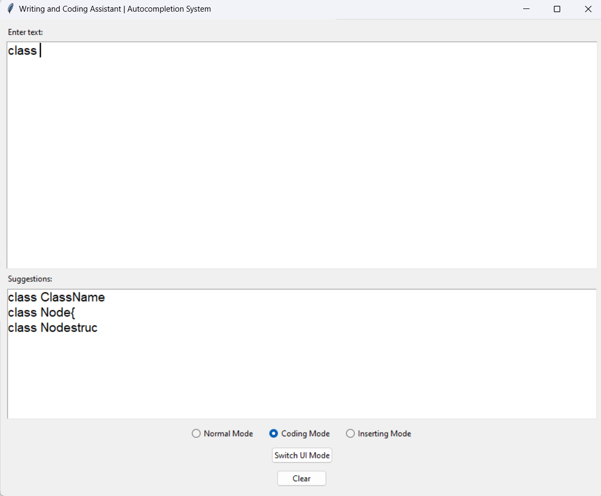

<b>Autocompletion system for coding assistance</b>

An intelligent autocompletion system that assists users while writing general text or programming code. It supports both normal typing mode and coding mode, making it ideal for writers, students, and developers.

<b>Problem Statement</b>
Typing speed and accuracy are essential in both casual writing and coding. However, repetitive typing, typos, and a lack of smart suggestions often slow users down.
This project addresses the problem by implementing a Trie-based autocompletion system that suggests relevant words or code snippets as users type, reducing effort and improving productivity.

<b>Objectives</b>
Implement an efficient autocomplete system using the Trie data structure.

Provide two modes:

Normal Mode for general English word completion.

Coding Mode for autocompleting programming terms and syntax.

Enable custom word insertion for both dictionaries to improve adaptability.

Offer a GUI interface with theme switching and easy navigation.

<b> Technology Stack</b>

Programming Lang :	Python

GUI	Tkinter

Data Structure:	Trie

File Handling	TXT-based word storage

OS Compatibility	Cross-platform (Windows/Linux)

<b>  Features</b>
Normal Mode – Autocompletion for regular English words.

Coding Mode – Suggestions tailored to coding keywords.

Custom Insert Mode – Add new words into dictionaries.

Theme Toggle – Switch between Light and Dark modes.

Clear Button – Reset the textbox easily.

Persistent Storage – Words are saved across sessions in .txt files.

Autocompletion system/
├── main.py                    

├── normal_dictionary.txt       

├── coding_dictionary.txt       

├── README.md                   

🖥️ How to Run
Ensure Python is installed (version 3.6+).

Place normal_dictionary.txt and coding_dictionary.txt in the same directory as main.py.

Run the app:  python main.py   (Make sure in the folder where main.py and the dictionaries are loaded)

DEMO : 

